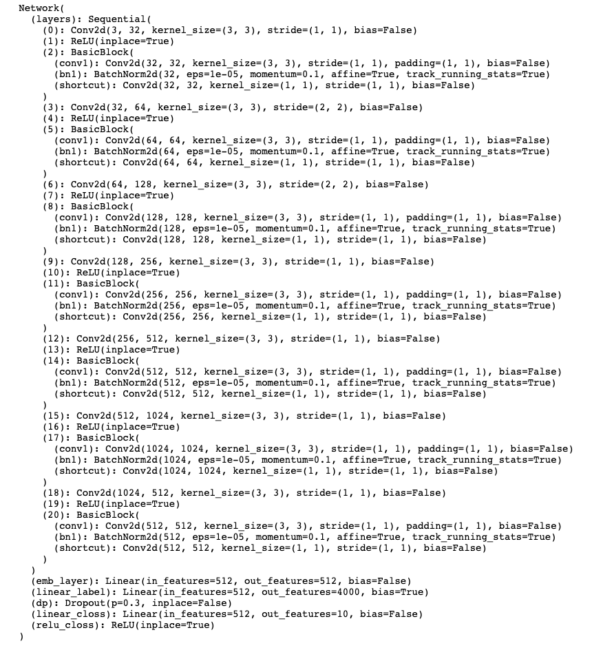
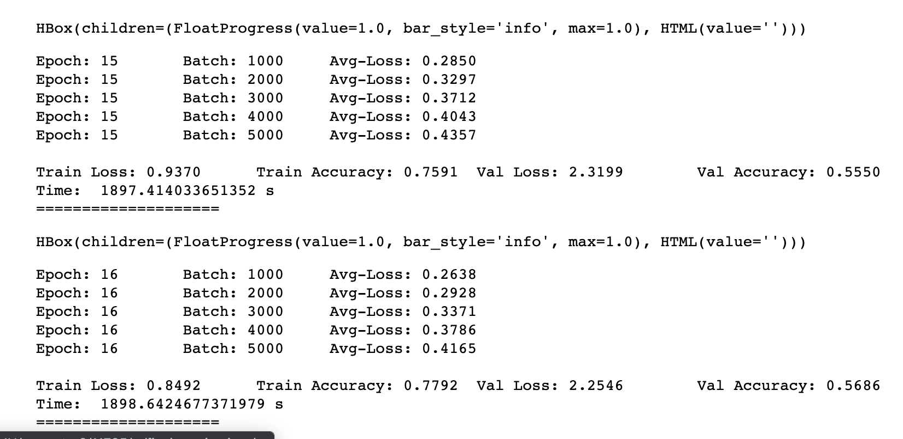
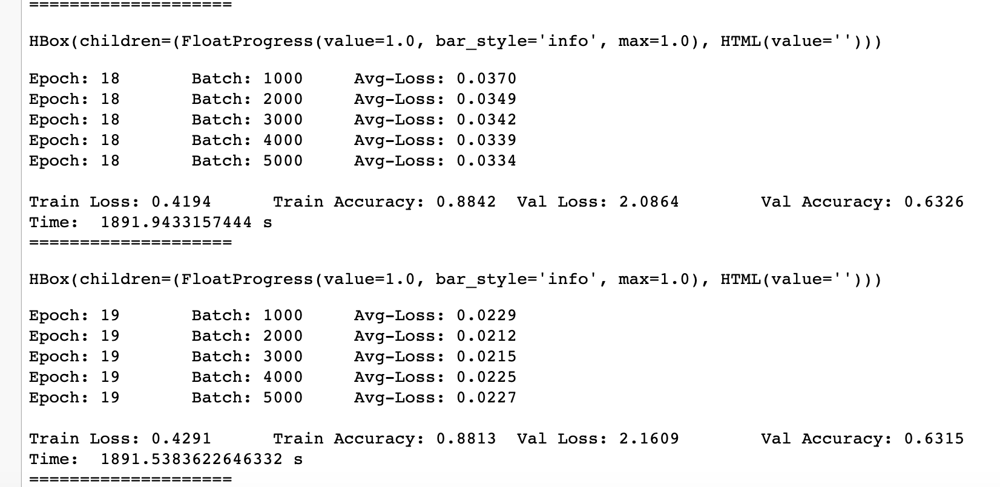
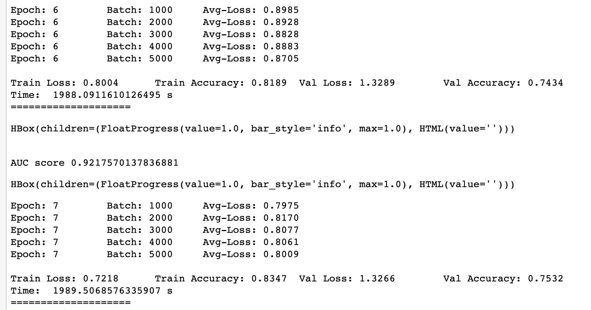

## 1. Model Architecture
•	Built a ResNet model by adding skip connections as more as possible; used classification train data to train the model

## 2. Training Process

1) At first I used lr =1e-2 and trained 16 epoch, in the last few epochs, val accuracy did not enhance much.

2) So after changing lr to 1e-3, based on the 15 epoch model in the first train, I trained 3 epoch, then stopped it because of performance not changing a lot.

3) My third train, based on the best model in second train, I used data augmentation method through random horizontal flipping or random vertical flipping, use lr=1e-3, trained 7 epoch.

4) I used center loss criterion combined crossentropy, with closs_weight = 1, lr_cent = 0.01, feat_dim = 10, train 4 epoch in my fourth train to improve the performance.

numEpochs = 25
num_feats = 3

## 3. Tricks to Enhance Model Performance

•	Applied center loss as loss criterion and used data augmentation by random horizontal flipping or random vertical flipping the raw pictures in order to improve performance on classification validation data.

•	Calculated cosine similarity through verification data face embedding pairs and used AUC score to evaluate the model performance for face verification.
